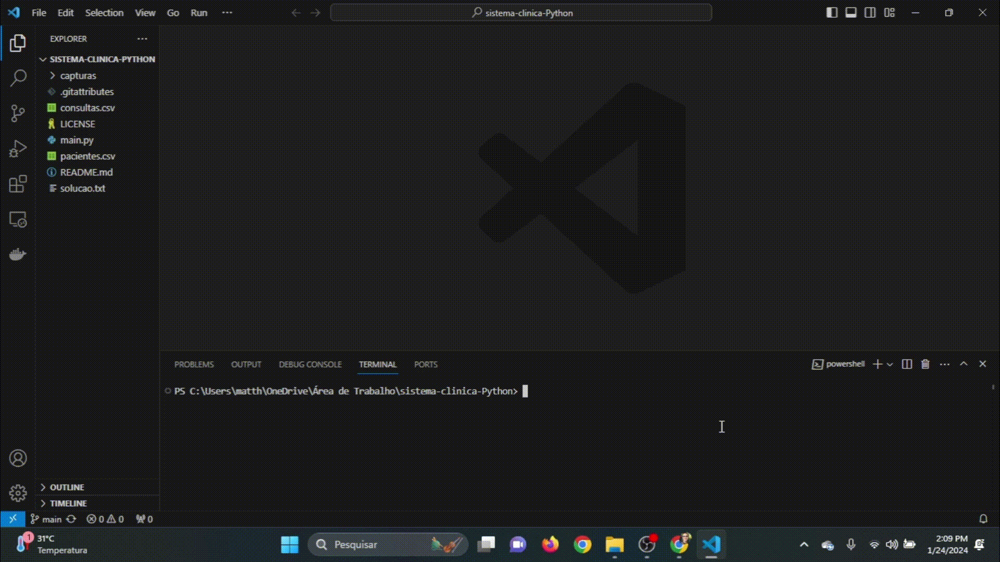
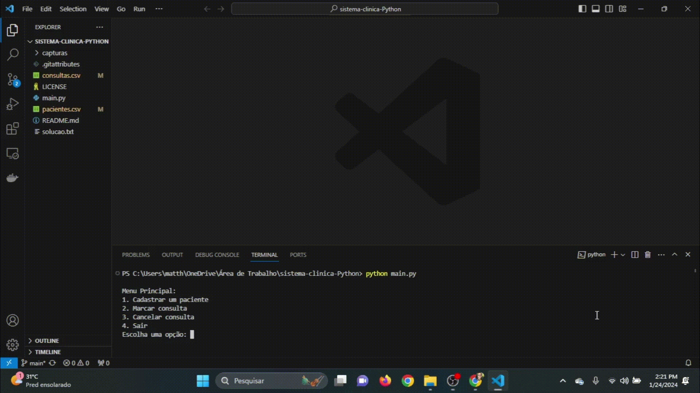
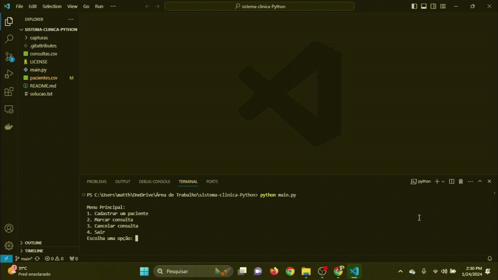

# Sistema de Agendamento Clínico

## O que é?
Uma aplicação desenvolvida para gerenciar consultas em uma clínica de saúde local. 

## Como funciona a aplicação?
A aplicação funciona da seguinte forma: É um sistema de gerenciamento de consultas, que disponibiliza opções de cadastrar, consultar e cancelar consultas de pacientes. Outro ponto importante, não é possivel cadastrar um paciente com o mesmo número de telefone;

## Como utilizar a aplicação?
Para utilizar a aplicação siga os passos abaixo:

1. **Clone o repositorio:**
   

2. **Cadastrando paciente:**
   

3. **Marcando consulta:**
   

4. **Cancelar consulta:**
   

5. **Saindo da aplicação:**
   

**Funcionalidades Implementadas:**

1. **Cadastro de Paciente:**
   - Cadastro simples com nome e telefone.
   - Evita duplicidade através da verificação do número de telefone.
   - Os dados dos pacientes são armazenados no arquivo `pacientes.csv`.

2. **Marcação de Consulta:**
   - Permite escolher um paciente e agendar uma consulta.
   - Verifica disponibilidade do horário e impede que seja realizados agendamentos retroativos.
   - As consultas agendadas são salvas no arquivo `consultas.csv`.

3. **Cancelamento de Consulta:**
   - Permite cancelar consultas existentes.
   - Mostra detalhes antes de confirmar o cancelamento.

4. **Persistência de Dados:**
   - É utilizado arquivos CSV para persistência dos dados entre execuções.
   - Ao iniciar, carrega automaticamente informações dos pacientes e consultas.

5. **Tratamento de Erros:**
   - Evita cadastros duplicados e agendamentos em horários ocupados.
   - As mensagens de erro vão ser visiveis para orientar o usuário.

  

## Ferramentas utilizadas:
    - Python (Estrutura da aplicação)
    - Csv (armazenar e manipular os dados de pacientes)

## Capturas de Tela do projeto

## Contato ✉️

- E-mail: mattheusp382@gmail.com
- LinkedIn: [Mattheus-Pereira](https://www.linkedin.com/in/mattheuspereira/)
- Portfólio: [mtp-dev.com](https://mtpdev.com.br/)

## Contribuição 🤝

Se você quiser contribuir com um projeto ou encontrar um problema, sinta-se à vontade para abrir um novo problema ou enviar uma solicitação pull. Qualquer contribuição é bem-vinda!

## Licença📄

Este portfólio está licenciado sob a [Licença MIT](https://opensource.org/licenses/MIT).
